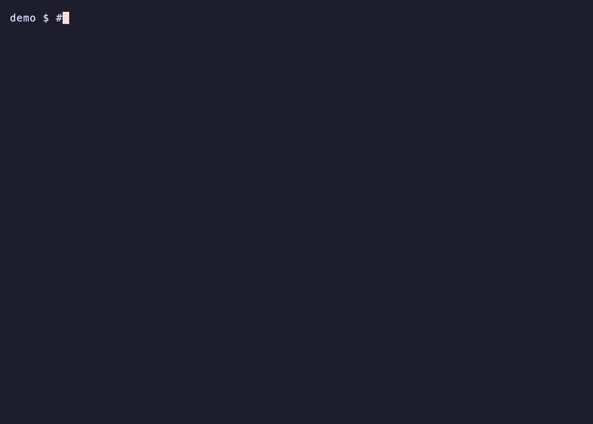
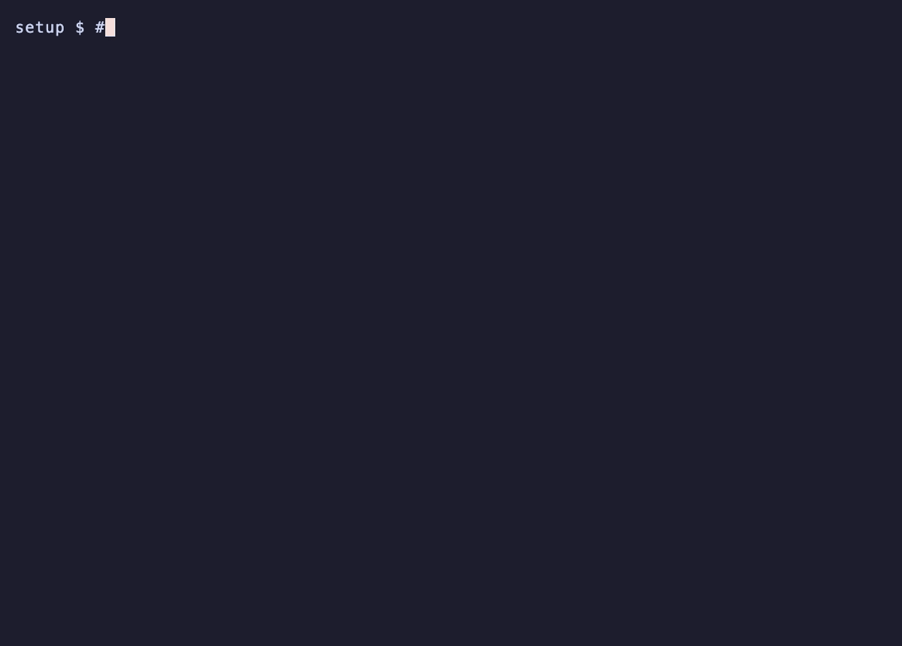

# m74-academy-cli

The `academy` command used in M74 Academy course modules. It runs a module's
lesson checks, opens its course preview, and checks the student's setup.
Course material itself is private; this tool is MIT-licensed.



The demo uses a synthetic exercise, not a course answer. Read the failed check,
edit and save your file, then run the same command again. The terminal editor is
only for this demo; you can edit in VS Code. `PASS` means the supplied checks passed.

## Install

Once per computer, with [uv](https://docs.astral.sh/uv/) and Git installed:

```console
uv tool install git+https://github.com/m74-academy/academy-cli
```

If uv reports that its tool folder is not on your `PATH`, run `uv tool update-shell`
and open a new terminal. The command runs each module's checks in that module's own
environment through `uv run`, so one installation serves every module.

## Check a module's setup



After cloning your module and running `uv sync --locked`, run `academy health`.
Each `FAIL` includes a fix; `WARN` and `INFO` are advice. `Setup looks good.` means
the required checks passed, even if a newer course release is available.
The recording reuses an existing fork; your first run creates one.

## Commands

Run these inside a module folder; `academy --help` (or `academy` alone) lists them with examples:

```console
academy test 1 2     # check chapter 1, lesson 2
academy test 1 2 --all  # show every failing check, not only the first
academy test 1       # check every coding lesson in chapter 1
academy docs         # open the course preview
academy health       # check Git, remotes, Python, uv, and module extras
academy update       # upgrade academy and get a newer course release
academy update --check  # only report available updates
```

`academy update` upgrades the command itself with `uv tool upgrade m74-academy-cli`
(on Windows it prints that command to run after `academy` exits). Inside a module
with a newer course release, it runs `git pull --no-rebase --no-edit upstream main`
and `uv sync --locked`. It never commits, discards, or pushes your work: uncommitted
changes stop it before the pull, and a merge conflict names the files to fix.

## Module configuration

A module declares itself in `[tool.academy]` of its `pyproject.toml`:

```toml
[tool.academy]
course-repo = "m74-academy/module-2"
written = ["1.1", "3.9"]    # lessons answered in answers/, not by code
checks = ["qt"]             # extra health checks
guides = "https://…/"       # optional: base URL of setup guides students can open

[tool.academy.chapters]
1 = ["Why Tools Need Context", "Environment and Path Templates"]
```

Lesson `N.M` expects `src/chapter_0N/lesson_0M.py` and
`tests/chapter_0N/test_lesson_0M.py`; written lessons expect
`answers/chapter_0N/lesson_0M.md`. Available extra checks: `qt` (PySide6 starts).

Compatible course releases: Module 0 0.1.0 and later, Module 1 0.8.0 and later, Module 2 0.2.0 and later.
By default the setup guides it links to are for enrolled students; a module sets `guides` to a
folder that holds its own `install-uv-and-git.md`, `fork-clone-setup.md`, and `course-updates.md`.
